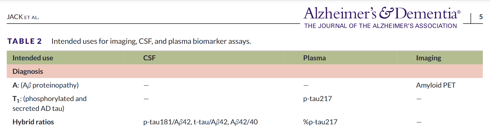
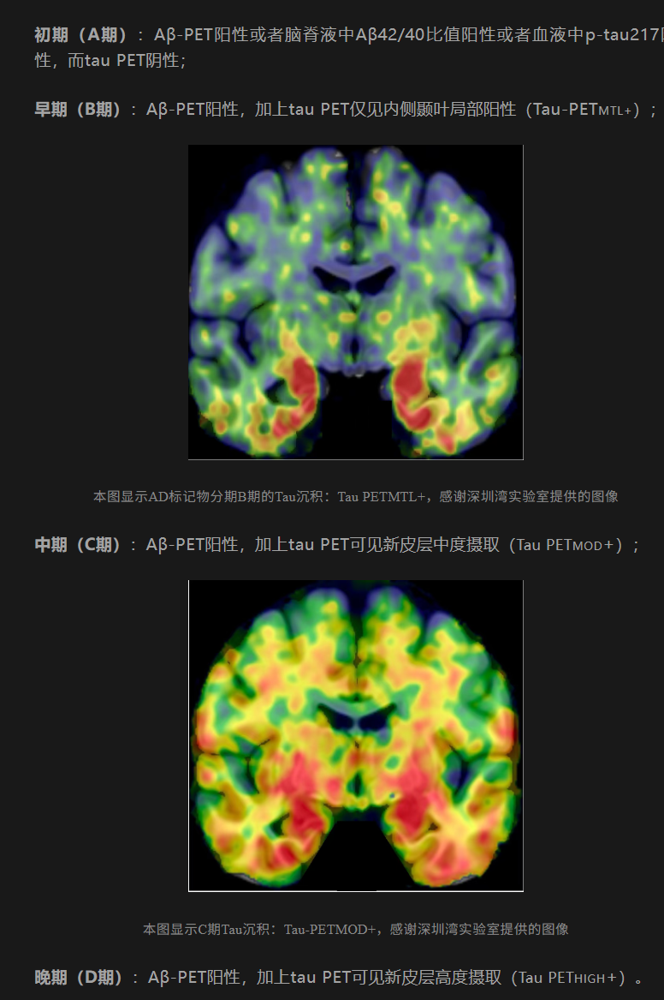

# 疾病标志物

## Tau蛋白

Tau蛋白是一种在神经细胞中发现的蛋白质，它在正常情况下有助于维持神经细胞内微管的稳定。然而，当tau蛋白异常磷酸化时，它会导致神经纤维缠结的形成，这是阿尔茨海默病（Alzheimer’s disease, AD）等神经退行性疾病的标志性病理特征之一。

### p-tau

磷酸化tau蛋白

## GFAP

星形胶质细胞GFAP标志物

标志物

SCD用SCD-9的表筛选

456用CDR主治医师进行判断

# 背景部分

